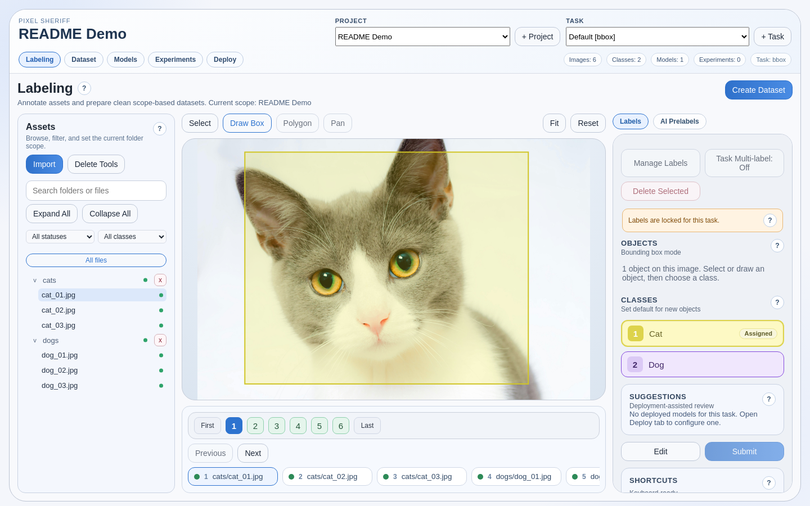
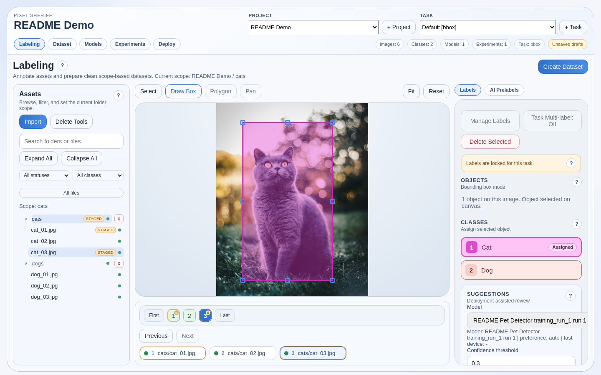
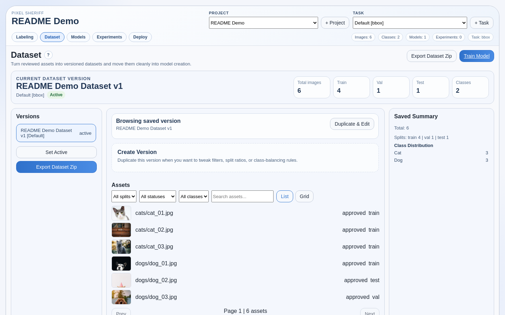
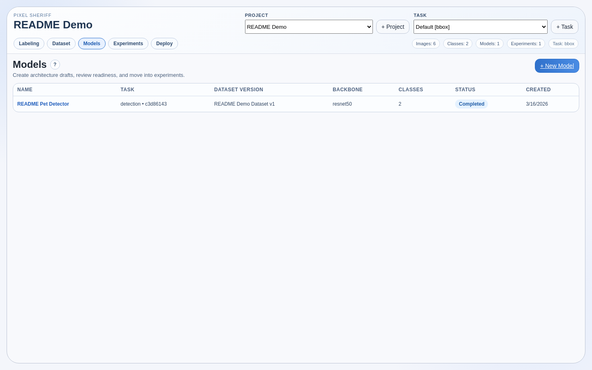
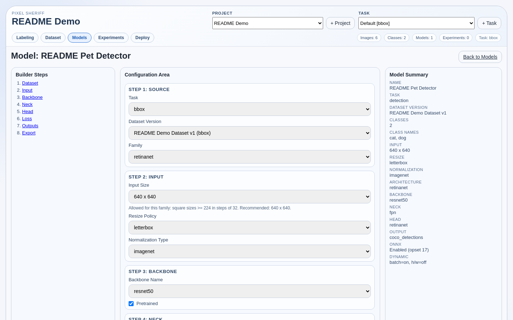
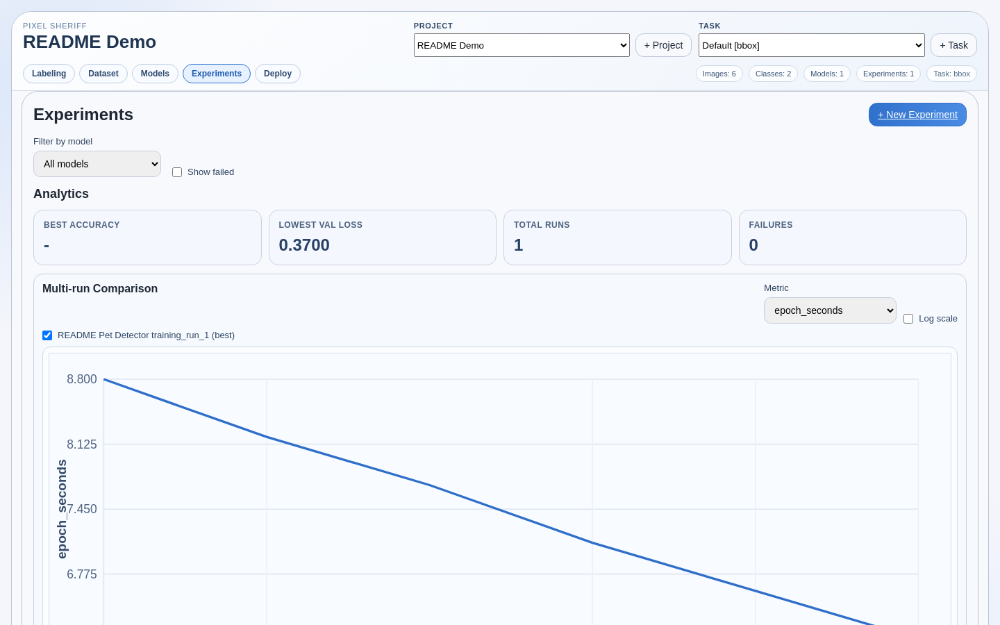
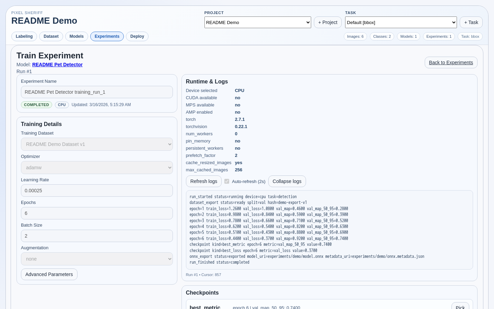
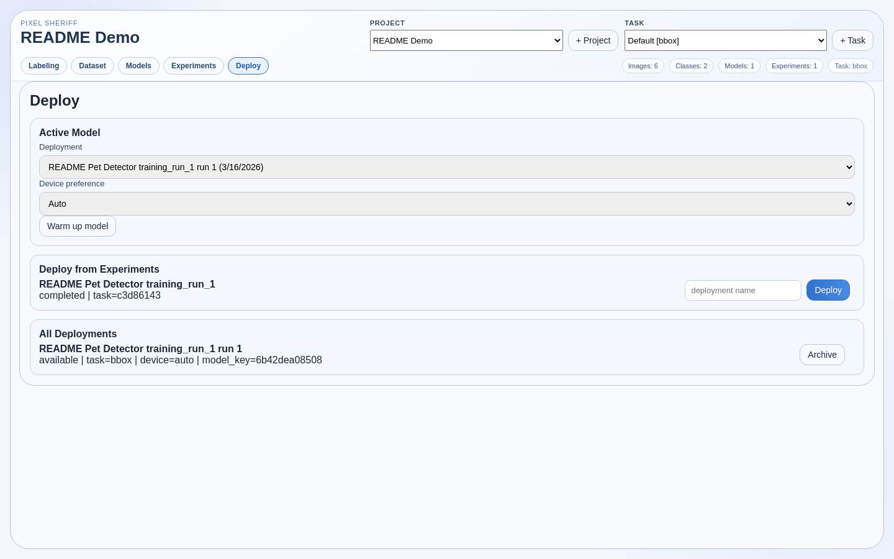
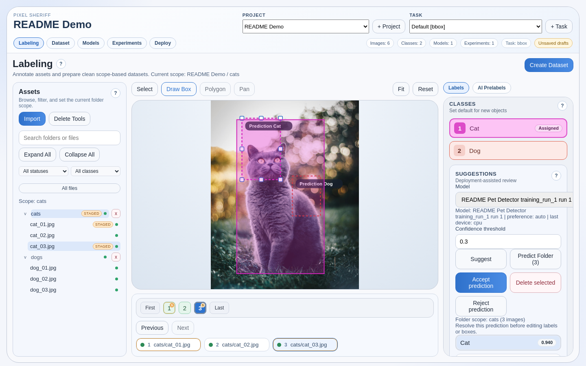

# pixel-sheriff

Local-first computer vision workflow for labeling assets, building datasets, training models, deploying them, and reviewing AI-assisted predictions in one place.

## Product Demo

Generated from the deterministic `README Demo` project in `docs/demo/` via `./scripts/run_demo_assets.sh assets`.

<p align="center">
  
</p>
<p align="center">
  
  
</p>
<p align="center">
  
  
</p>
<p align="center">
  
  
</p>
<p align="center">
  
  
</p>
<p align="center">
  
</p>

## What Pixel Sheriff Does

Pixel Sheriff is built for computer vision projects that need more than just annotation. It lets you move from raw assets to dataset versions, experiments, deployments, and model-assisted review inside one project-scoped workflow.

It is image-first even when the source starts as a video file or live webcam stream:

- image files are stored as normal assets
- video imports extract frames into a sequence folder
- webcam capture uploads frames into a live sequence folder
- all labeling happens in the same asset workspace
- datasets, exports, and downstream workflows remain frame-based

## What It Is For

Pixel Sheriff is a fit for teams who want to:

- label and review computer vision data locally
- treat images, video frames, and webcam captures as part of one workflow
- create immutable dataset versions for repeatable training
- run experiments and keep model history tied to the project
- deploy a trained model and use its predictions as review-first suggestions during labeling

## Supported Tasks

Current task modes:

- `classification`
- `bbox`
- `segmentation`

Current AI-assisted workflows:

- review-first deployment predictions for the active asset, plus folder-scoped batch prediction review in `classification` and `bbox`
- sequence-first AI prelabels for `bbox` tasks
- pending prelabels stored separately from normal annotations until accepted or edited

## End-to-End Flow

```text
image files
-> assets
-> labels / boxes / polygons
-> dataset versions
-> models
-> experiments
-> deployments

video file / webcam stream
-> extracted or captured frames
-> asset sequence + folder
-> same labeling workspace
-> same dataset/export flow
```

## Main Features

- project-scoped shell with task selector and task-aware routes
- folder tree plus searchable asset browser
- image import, video import, and webcam capture
- sequence navigation for video and webcam frames
- classification, bbox, and polygon annotation tools
- staged edit workflow plus direct submit
- immutable dataset versions with saved split membership
- export zip generation with `manifest.json` and `coco_instances.json`
- project-scoped models, experiments, and deployments
- FP32, PTQ INT8, and QAT INT8 experiment variant comparison for `classification` and `detection` models
- review-first deployment predictions with preview, accept, and reject in labeling
- bbox prelabel sessions for video and webcam review flows

## Typical Workflow

1. Create or select a project.
2. Select or create a task from the ribbon.
3. Use `Import` for images, `Video File` for extraction, or `Webcam Stream` for live capture.
4. Label assets in the main workspace.
5. For sequence-backed assets, use the timeline, thumbnails, and frame controls.
6. For `bbox` tasks, optionally enable AI prelabels during video import or webcam capture.
7. Review pending AI prelabels and promote accepted or edited proposals into annotations.
8. Create a dataset version.
9. Create or edit a model.
10. Launch and monitor experiments.
11. Deploy a completed experiment and use deployment predictions in labeling.
12. Review the prediction, then `Accept` to stage it into the draft or `Reject` to keep the prior draft unchanged.
13. Use `Submit` to persist accepted draft changes.

## Quickstart

### Prerequisites

- Docker + Docker Compose
- Make

Optional for local non-Docker iteration:

- Node.js
- Python 3.11+

### Start

1. Copy environment defaults:

```bash
cp .env.example .env
```

2. Start the full stack:

```bash
make up
```

3. Open:

- Web: `http://localhost:3010`
- API docs: `http://localhost:8010/docs`
- API base: `http://localhost:8010/api/v1`

## Runtime Topology

Default services:

- `apps/web`: Next.js frontend
- `apps/api`: FastAPI backend
- `apps/worker`: Redis-backed media and prelabel worker
- `apps/trainer`: training plus inference service
- `db`: PostgreSQL
- `redis`: queues

High-level flow:

```text
browser
-> web
-> api
   -> postgres
   -> redis -> worker
   -> trainer
```

Important behavior:

- `make up` starts the full stack
- `make up-web-api` is a lighter loop and does not start the worker or trainer
- video extraction requires the worker
- training, deployment inference, and Florence prelabels require the trainer

## Deployment Predictions

Supported in the labeling workspace today:

- `classification`
- `bbox`

Current review behavior:

- `Suggest` requests predictions for the currently selected asset
- `Predict Folder` requests predictions for every image in the selected folder scope and builds a per-image review queue
- clicking `Suggest` creates a pending review instead of mutating the draft immediately
- while a pending classification review exists, label editing is temporarily locked
- while a pending bbox review exists, the normal draft remains locked but the predicted boxes themselves can be selected, moved, resized, and deleted before accept
- `Reject prediction` clears the pending review and leaves the existing draft unchanged
- `Accept selected` or `Accept prediction` copies the reviewed result into the normal draft
- folder review accept or reject auto-advances to the next pending image when one exists
- accepted predictions are not saved until the normal `Submit` action runs

Task-specific behavior:

- classification: the UI shows a ranked prediction list
- classification: you can choose a non-top-1 row before accepting
- classification: accepting stages exactly one class selection and stores shared `prediction_review` metadata in the annotation payload
- bbox: the UI shows predicted boxes as a separate preview overlay on top of the image
- bbox: pending predicted boxes can be edited or deleted before accept
- bbox: accepting replaces the asset's current draft object set with the reviewed prediction
- bbox: accepted boxes keep `deployment_prediction` provenance including model name, confidence, and review decision

Current limitations:

- segmentation deployment review is not wired into the labeling UI yet
- folder review is still image-by-image; there is no one-click bulk accept-all or reject-all action for deployment predictions yet

## AI Prelabels

Implemented today:

- `bbox` only
- sources: `active_deployment`, `florence2`
- video: a session is created from `prelabel_config` and jobs auto-start after frame extraction
- webcam: a live session is created at capture start and sampled frames enqueue while capture is running
- webcam: modal finish closes input for the live session

Review behavior:

- pending proposals stay out of normal annotations
- reviewed proposal geometry and category, when present, become the source of truth for display, edit, and accept
- `Accept` merges the effective reviewed-or-original proposal state into the asset annotation payload
- `Edit selected` loads the effective reviewed-or-original proposal state into the normal bbox draft with provenance
- saved provenance-backed objects mark proposals as `accepted` or `edited`

Deployment predictions and AI prelabels are intentionally separate:

- deployment predictions are review-first helpers in the main labeling panel for the current asset or the current folder queue
- AI prelabels are session-driven `bbox` proposals for video and webcam review

## Storage Model

Database state includes:

- projects
- tasks
- categories
- folders
- asset sequences
- assets
- annotations
- prelabel sessions
- prelabel proposals
- suggestions

File-backed storage under `./data` includes:

- uploaded assets
- imported videos
- dataset and version records
- export zips
- model records
- experiment artifacts

## Useful Commands

Full stack:

```bash
make help
make up
make down
make logs
make ps
```

Fast web/API loop:

```bash
make build-web-api
make up-web-api
docker compose up -d worker
make up-trainer
```

Trainer iteration:

```bash
make build-trainer-base
make build-trainer
make build-trainer-bootstrap
make up-trainer
```

Local app iteration:

```bash
make infra
make create-local-db
make dev-api
make dev-web
```

Checks:

```bash
make test-web
make test-web-smoke
make test-api
make test-api-ml
make test-api-focused
make test-trainer
make test-worker
make test-all
make coverage-all
make verify-cross-boundary
make contracts-sync
make contracts-check
```

## Documentation

Current docs:

- `docs/README.md`
- `docs/architecture.md`
- `docs/demo/README.md`
- `docs/CHANGELOG.md`
- `docs/plans/`
- `docs/archive/`

Other folders:

- `docs/demo/` contains generated README and demo media
- `docs/plans/` contains dated design notes, active trackers, and plan snapshots
- `docs/archive/` contains historical notes moved out of the former `docu/` directory

## Codebase Map

Frontend:

- `apps/web/src/app/projects/[projectId]/`
- `apps/web/src/components/workspace/ProjectAssetsWorkspace.tsx`
- `apps/web/src/components/workspace/project-assets/`
- `apps/web/src/lib/hooks/`
- `apps/web/src/lib/api/`

Backend:

- `apps/api/src/sheriff_api/main.py`
- `apps/api/src/sheriff_api/db/models.py`
- `apps/api/src/sheriff_api/routers/`
- `apps/api/src/sheriff_api/services/`

Worker and trainer:

- `apps/worker/src/sheriff_worker/main.py`
- `apps/worker/src/sheriff_worker/jobs/`
- `apps/trainer/src/pixel_sheriff_trainer/`

Shared contracts:

- `packages/contracts`

## Notes

- sequence frames export as normal images with lineage metadata
- current documentation now lives under `docs/`; use `docs/archive/` only for historical context
- see `docs/README.md` for test and coverage environment caveats before relying on local runners
