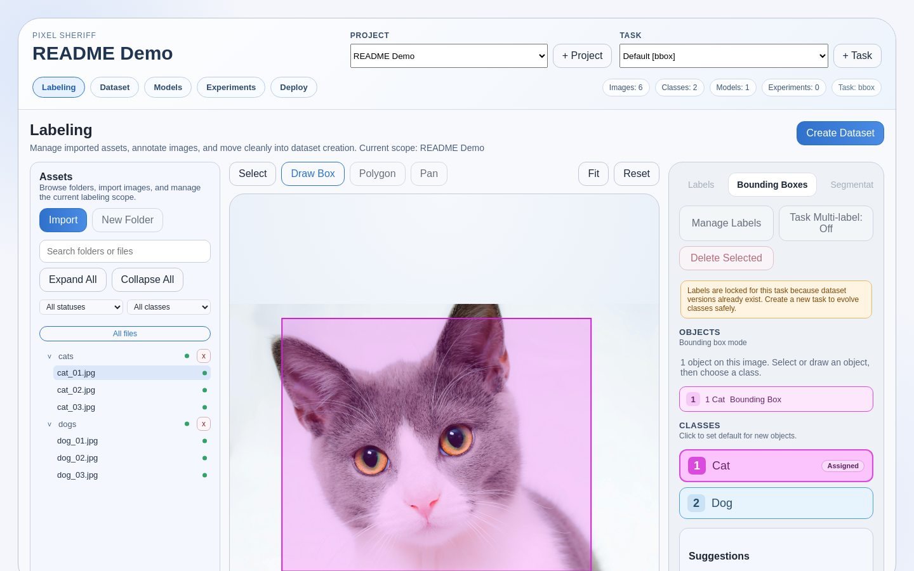
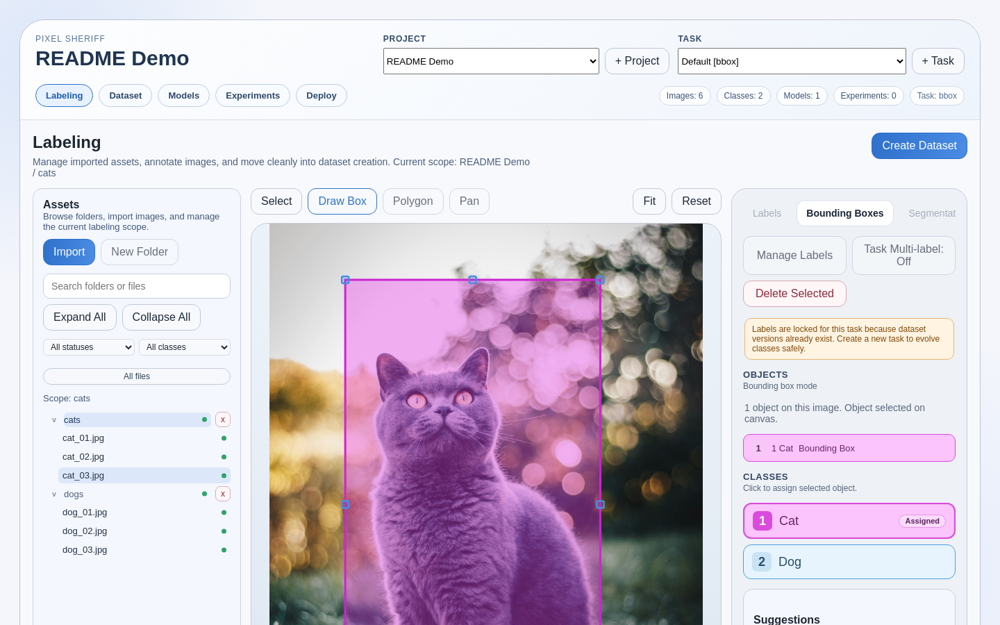
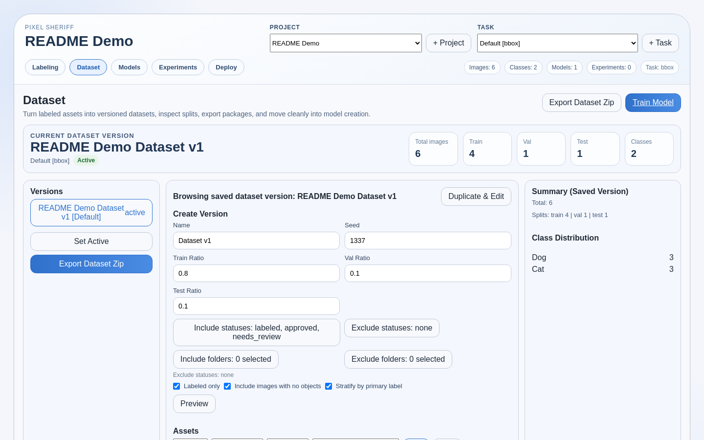
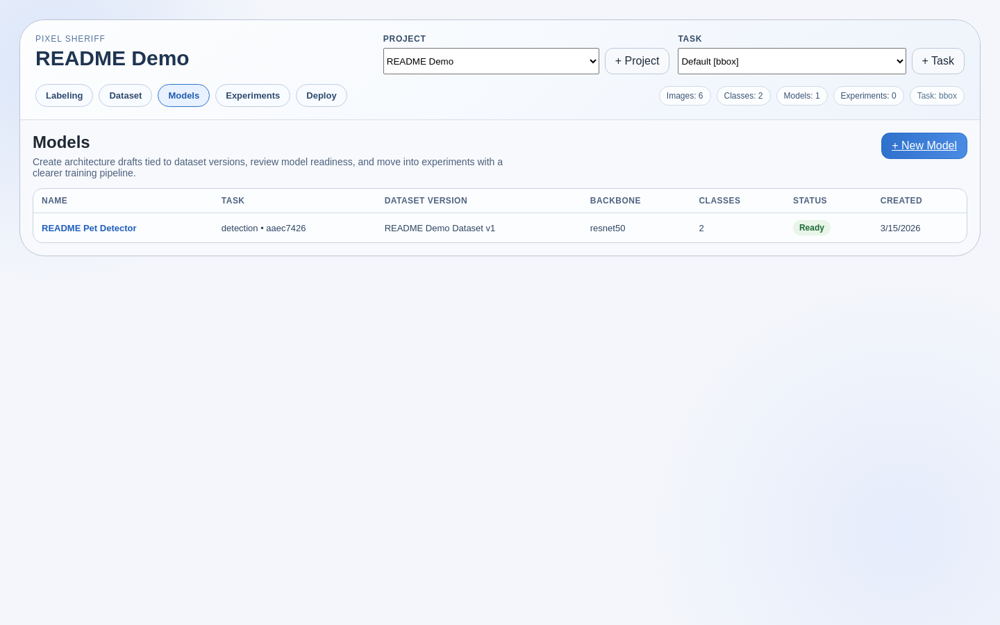
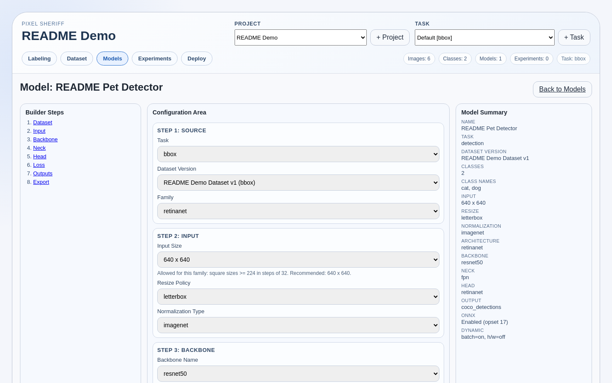

# Demo Assets

This folder holds README and docs media generated by the automated demo pipeline:

- `hero-demo.webm`
- `hero-demo.mp4` when `ffmpeg` is available
- `hero-demo.gif` when `ffmpeg` is available
- `screenshot-01-assets.png`
- `screenshot-02-labeling.png`
- `screenshot-03-dataset.png`
- `screenshot-04-models.png`
- `screenshot-05-builder.png`

## Preview

These are the checked-in demo outputs that the root `README.md` now renders directly.

<p align="center">
  
</p>
<p align="center">
  
  
</p>
<p align="center">
  
  
</p>
<p align="center">
  
</p>

## Commands

From the repo root:

```bash
./scripts/run_demo_assets.sh hero
./scripts/run_demo_assets.sh screenshots
./scripts/run_demo_assets.sh assets
```

Or via `make`:

```bash
make demo-hero
make demo-screenshots
make demo-assets
```

## Behavior

- The pipeline deletes and recreates a dedicated `README Demo` project on every run.
- It seeds deterministic bbox fixture data through the public API from the committed source images under `docs/demo/source-images`.
- It builds isolated `api-demo`, `trainer-demo`, and `web-demo` images from the current checked-out source before capture.
- The hero walkthrough is generated with Playwright and copied into `docs/demo/`.
- Screenshots are captured programmatically with a fixed viewport and stable filenames.
- Raw capture artifacts are stored under `artifacts/demo/`.
- `./scripts/run_demo_assets.sh` runs the capture flow in Docker via the Compose `demo-runner` service, so it does not depend on host Playwright browser packages.

## Playwright Demo Specs

Current demo/browser specs under `apps/web/tests/demo/`:

- `hero-demo.spec.mjs`: walkthrough capture for the hero media
- `screenshots.spec.mjs`: deterministic documentation screenshots
- `prelabels-review.spec.mjs`: bbox AI prelabel review flow
- `prediction-review.spec.mjs`: deployed prediction accept/reject flow for bbox and classification

Playwright output is written to `artifacts/demo/playwright-output/`.

## Prerequisites

- Docker Compose for the app stack
- Docker access that can pull `mcr.microsoft.com/playwright:v1.41.2-jammy` for the `demo-runner` image the first time
- `ffmpeg` only if you want MP4 and GIF outputs

## Direct Web Commands

If you want to run the demo specs outside Docker, the web package also exposes:

```bash
cd apps/web
npm run demo:hero
npm run demo:screenshots
npm run demo:assets
```

That local path expects a working Node environment plus Playwright browser/runtime dependencies on the host.

## Full Browser Review Pass

To run the deployed prediction browser pass in Docker against the isolated demo stack:

```bash
docker compose --profile demo build api-demo trainer-demo web-demo
docker compose --profile demo up -d db-demo redis-demo trainer-demo api-demo web-demo
docker compose --profile demo run --rm demo-runner bash -lc "npm ci --cache /tmp/npm-cache && npx playwright test tests/demo/prediction-review.spec.mjs --config=playwright.demo.config.mjs"
```

That spec verifies the current review-first behavior:

- bbox predictions render as a separate preview and can be rejected or accepted
- accepted bbox predictions replace the current draft boxes and persist deployment provenance on submit
- classification predictions can be re-ranked in the side panel before acceptance
- accepted classification predictions persist `prediction_review` metadata on submit

## Updating README Media

After UI changes, rerun:

```bash
./scripts/run_demo_assets.sh assets
```

The command will refresh the demo project, regenerate the hero media, and rewrite the screenshots in this folder. WebM is the guaranteed primary output; MP4 and GIF are optional post-processed variants.
